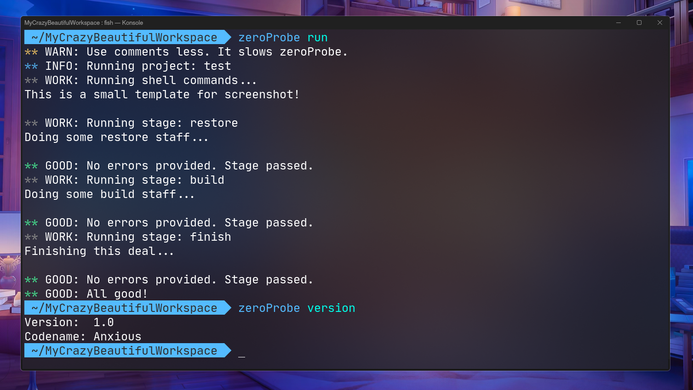

# zeroProbe

<div id="badges" >
    <a href="https://www.codacy.com/gl/kostya-zero/zeroprobe/dashboard?utm_source=gitlab.com&amp;utm_medium=referral&amp;utm_content=kostya-zero/zeroprobe&amp;utm_campaign=Badge_Grade">
        
    </a>
    <a href="https://github.com/kostya-zero/zeroProbe/actions/workflows/dotnet.yml">
        
    </a>
    <a href="https://img.shields.io/github/commit-activity/w/kostya-zero/zeroProbe">
        
    </a>
    <a href="https://img.shields.io/github/last-commit/kostya-zero/zeroProbe">
        
    </a>
    <a href="https://gitlab.com/kostya-zero/zeroprobe">
        
    </a>
    <a href="https://github.com/kostya-zero/zeroProbe">
        
    </a>
 </div>

Want to automate your test's? 
Find where errors can occur? 
Make build script? 
**zeroProbe can do that!** 
It's an unique and advanced utility made to help you with test management and other staff like build, deploying and more.
Everything writes in one single configuration file.
zeroProbe are powerful tool in right hand! 
This tool made for every you need.
Developers of zeroProbe also use this for test's on zeroProbe (what).
In future updates we will bring to zeroProbe more new features to make your work more cool and flexible.



> Not final version. Look may change with release.

## Features
### Your powerful tool
zeroProbe made not only for test's.
Also, you can build scripts for your C++/C or another projects.
Or, make a script to fast commiting and pushing to your repository.
You can do anything what on your mind.
Just try it!

### Easy-to-use
The first task in development of zeroProbe was to create easy-to-use tool with simple configuration.
So, we did our task.
You don't need any skill's to write configuration for zeroProbe. 
We name this type of configuration files - ProbeConfig.
Syntax of ProbeConfig are similar to other configurations like INI.
Take a look:
```
&project: Build File Lister
&checkfor: g++ gcc
&stages: build, test

!build: g++ main.cpp src/io.cpp src/io.h src/fs.cpp src/fs.h -o file_lister
!test: ./file_lister
```

### Speed, I'm speed...
zeroProbe was too fast than we expect.
Really, we made an easy and fast utility for test and not only for testing.
That's a great achievement for us.
Also, project written in C# with .NET 6 framework.
And, if you was in searching of fast utility for test or building other configurations - that's your station.

### Helpful guides
zeroProbe have guides on [GitHub](https://github.com/kostya-zero/zeroProbe/wiki) and [GitLab](https://gitlab.com/kostya-zero/zeroprobe/-/wikis/home) wiki.
If you want to know more about it, you can check it. 
Wiki updates with every new features in zeroProbe or if developers want to tell more about.

## Bridge for zeroProbe (soon)
Bridge is internal program to interact with zeroProbe fast and easier with less typing.
How it works?
- zeroProbe will has `--bridge` argument. To enable Bridge mode, use `--bridge=1`. 
- Run commands like in terminal, but without zeroProbe at start.
- You can interact with your project in real-time.

## Build from source
### Install build dependencies
zeroProbe use .NET 6 framework to run. To build you must have `dotnet-runtime` and `dotnet-sdk` installed.
- Ubuntu, Debian, Debian-based and Ubuntu-based:
```shell
sudo apt-get update && apt-get upgrade     # Update repositories and packages
sudo apt-get install -y dotnet-runtime-6.0 # Install runtime
sudo apt-get install -y dotnet-sdk-6.0     # Install SDK
```
- Fedora:
```shell
sudo dnf install dotnet-runtime-6.0 # Install runtime
sudo dnf install dotnet-sdk-6.0     # Install SDK
```
- ArchLinux, Manjaro and ArchLinux-based:
```shell
sudo pacman -Syu dotnet-runtime dotnet-sdk # Install runtime and SDK
```
- openSUSE:
```shell
sudo zypper install dotnet-sdk-6.0     # Install SDK
sudo zypper install dotnet-runtime-6.0 # Install runtime
```

### Prepare workspace 
Firstly, clone official repository from [GitLab](https://gitlab.com/kostya-zero/zeroprobe). 
We recommend you to clone sources from GitLab, because it updates frequently than GitHub.
```shell
git clone https://gitlab.com/kostya-zero/zeroprobe.git # Cloning GitLab repo
cd zeroprobe                                           # Moving to cloned repo directory
```

### Run build 
Now, the final moment, running build of zeroProbe.
```shell
dotnet restore            # Restore dependencies
dotnet build --no-restore # Building
```

## Credits
Developers:
- Konstantin ".ZERO" Zhigaylo - main developer

Tools and websites used in development:
- Codacy
- JetBrains Rider 2022.1.3
- GitHub Workflows
